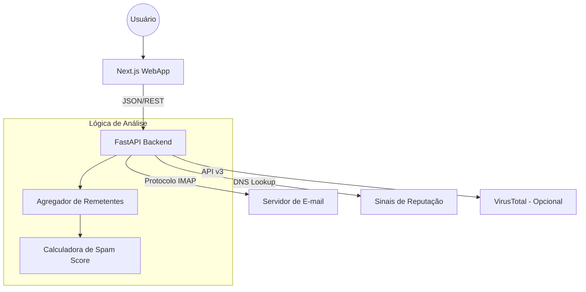

# PyMail Analyser

Bem-vindo à documentação oficial do **PyMail Analyser**. Este projeto é uma ferramenta full-stack projetada para ajudar usuários a limpar suas caixas de entrada IMAP, identificando remetentes de baixa relevância e permitindo ações em lote (excluir/arquivar).

## 🚀 Visão Geral do Sistema

O sistema funciona conectando-se de forma segura à sua conta de e-mail via protocolo IMAP, analisando o comportamento dos remetentes e cruzando dados com sinais de reputação de domínio.



## 🛠️ Tecnologias Utilizadas

### Backend (`pymail-api`)
- **FastAPI**: Framework web de alta performance.
- **Pydantic**: Validação de dados e esquemas.
- **imap-tools**: Biblioteca robusta para interação IMAP.
- **dnspython**: Verificação de registros MX, SPF e DMARC.

### Frontend (`pymail-webapp`)
- **Next.js 15+**: Framework React com suporte a SSR/App Router.
- **Tailwind CSS**: Estilização moderna e responsiva.
- **TanStack Query**: Gerenciamento de estado e cache de requisições.
- **Lucide React**: Biblioteca de ícones.

## 📦 Estrutura do Monorepo

```text
pymail-analyser/
├── pymail-api/        # API Python (FastAPI)
├── pymail-webapp/     # Interface Web (Next.js)
├── docs/              # Documentação unificada (MkDocs)
└── docker-compose.yml # Orquestração para desenvolvimento
```
