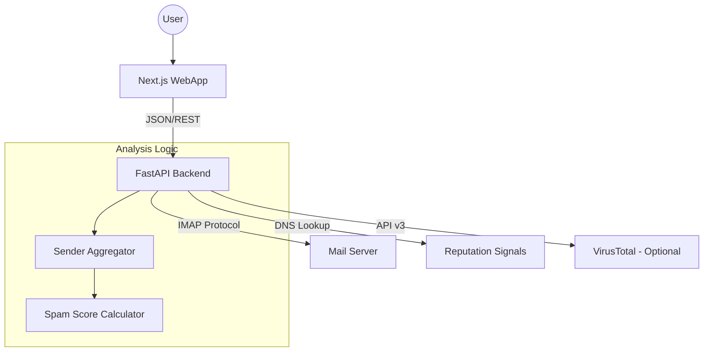

# PyMail Analyser

Welcome to the official documentation for **PyMail Analyser**. This project is a full-stack tool designed to help users clean IMAP inboxes by identifying low-value senders and enabling bulk actions (delete/archive).

## 🚀 System Overview

The system works by securely connecting to your email account via IMAP, analyzing sender behavior, and correlating that data with domain reputation signals.



## 🛠️ Technologies Used

### Backend (`pymail-api`)
- **FastAPI**: High-performance web framework.
- **Pydantic**: Data validation and schema handling.
- **imap-tools**: Robust library for IMAP interaction.
- **dnspython**: MX, SPF and DMARC record lookup.

### Frontend (`pymail-webapp`)
- **Next.js 15+**: React framework with SSR/App Router support.
- **Tailwind CSS**: Modern, responsive styling.
- **TanStack Query**: Request state management and caching.
- **Lucide React**: Icon library.

## 📦 Monorepo Structure

```text
pymail-analyser/
├── pymail-api/        # Python API (FastAPI)
├── pymail-webapp/     # Web interface (Next.js)
├── docs/              # Unified documentation (MkDocs)
└── docker-compose.yml # Development orchestration
```

## 📚 Documentation Quick Links
- [Docs Home](index.md)
- [Backend Documentation](backend/index.md)
- [Frontend Documentation](frontend/index.md)
- [Backend Analyzer Reference](backend/analyzer.md)
- [Backend Domain Reputation](backend/reputation.md)
- [Frontend Components Guide](frontend/components.md)
- [Frontend Utilities](frontend/utils.md)
- [Contribution Guide](../CONTRIBUTING.md)
